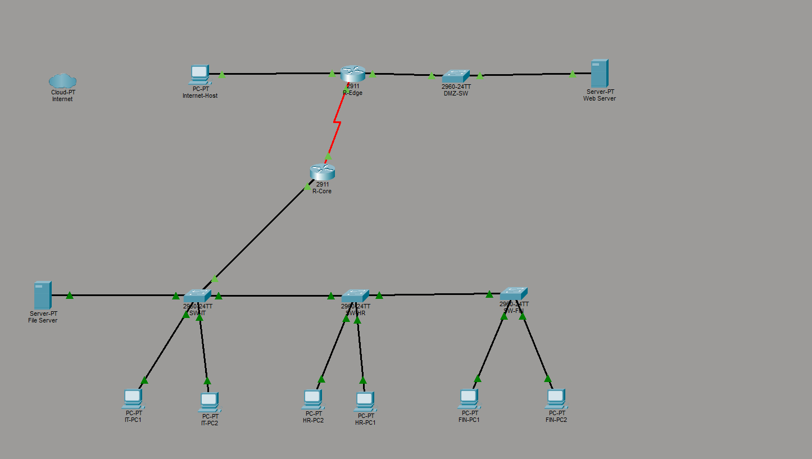

# Secure Campus Network — VLANs, ACLs, Port Security & SSH

A Cisco Packet Tracer project implementing a multi-department campus network with enterprise security controls: VLAN segmentation, extended ACLs for inter-department policy, port security on access switches, SSH for remote management, and a DMZ hosting a public web server.

This is **Project 2** in my Packet Tracer series, building on a basic multi-VLAN design ([Project 1](https://github.com/invicibleforce/multi-branch-vlan-network)) by adding the security layer that every real network actually uses.

📖 **Read the full write-up on Medium:** [Building a Secure Campus Network: VLANs, ACLs, Port Security, and SSH in Cisco Packet Tracer](https://medium.com/@kwadwoosei724/building-a-secure-campus-network-vlans-acls-port-security-and-ssh-in-cisco-packet-tracer-ae8e4b56b642)

---

## Table of Contents

- [Overview](#overview)
- [Topology](#topology)
- [Devices](#devices)
- [IP Addressing Plan](#ip-addressing-plan)
- [Interface Map](#interface-map)
- [Configuration Highlights](#configuration-highlights)
  - [Router-on-a-stick VLAN routing](#router-on-a-stick-vlan-routing)
  - [SSH remote management](#ssh-remote-management)
  - [Port security](#port-security)
  - [Extended ACLs — inter-department policy](#extended-acls--inter-department-policy)
  - [Perimeter ACL on the edge router](#perimeter-acl-on-the-edge-router)
- [Verification](#verification)
- [Known Issues & Gotchas](#known-issues--gotchas)
- [Files](#files)
- [Future Extensions](#future-extensions)

---

## Overview

**Goal:** Build a campus network for three departments (HR, Finance, IT), apply enterprise-grade security controls, and host a DMZ web server reachable from the simulated internet but isolated from internal subnets.

**What's enforced:**

- HR cannot initiate connections to Finance (but Finance → HR works — asymmetric policy)
- HR and Finance cannot ping their own router gateways
- IT has full unrestricted access
- All departments can reach the DMZ web server on HTTP/HTTPS
- Internet hosts can browse the web server but cannot reach internal subnets
- Telnet is disabled; all remote management is SSH-only
- Access ports are MAC-locked with port security
- All device passwords are encrypted, login banners are set, console sessions time out

---

## Topology



```
                  [Internet-Host 8.8.8.10/24]
                              |
                              | Copper straight
                              |
                       +------------+
                       |  R-Edge    |
                       |  Gi0/0     | ←── FROM-INTERNET ACL applied here
                       +-----+------+
                             |
                Gi0/1 (203.0.113.1/28)
                             |
                       [DMZ Switch]
                             |
                       [WebServer 203.0.113.10]

                       [R-Edge Se0/3/0] ───── serial ───── [R-Core Se0/3/0]
                       10.1.1.1/30 (DCE)                   10.1.1.2/30

                                                      [R-Core Gi0/0]
                                                      (router-on-a-stick)
                                                            |
                                                       [SW-IT]
                                                       Gi0/1 ↑ R-Core
                                                       Gi0/2 ↓ SW-HR
                                                            |
                                                       [SW-HR]
                                                       Gi0/2 ↓ SW-FIN
                                                            |
                                                       [SW-FIN]

  HR PCs ── SW-HR        FIN PCs ── SW-FIN        IT PCs + FileServer ── SW-IT
  (VLAN 10)              (VLAN 20)                (VLAN 30)
```

All three inter-switch links and the R-Core uplink are 802.1Q trunks carrying VLANs 10, 20, and 30.

---

## Devices

| Device | Model | Qty | Role |
|---|---|---|---|
| R-Edge | Cisco 2911 | 1 | Internet edge, DMZ gateway, perimeter ACL |
| R-Core | Cisco 2911 | 1 | Inter-VLAN routing, departmental ACLs |
| SW-HR | Cisco 2960 | 1 | HR access switch, VLAN 10 |
| SW-FIN | Cisco 2960 | 1 | Finance access switch, VLAN 20 |
| SW-IT | Cisco 2960 | 1 | IT access switch, VLAN 30 |
| DMZ-SW | Cisco 2960 | 1 | DMZ segment |
| WebServer | Server-PT | 1 | Public web server (HTTP/HTTPS) |
| FileServer | Server-PT | 1 | Internal file server (VLAN 30) |
| HR-PC1, HR-PC2 | PC-PT | 2 | HR workstations |
| FIN-PC1, FIN-PC2 | PC-PT | 2 | Finance workstations |
| IT-PC1, IT-PC2 | PC-PT | 2 | IT workstations |
| Internet-Host | PC-PT | 1 | Simulated external user |

**Modules needed:**
- HWIC-2T on both R-Edge and R-Core (for the serial WAN link)

---

## IP Addressing Plan

| Segment | Network | Mask | Gateway | Purpose |
|---|---|---|---|---|
| HR VLAN 10 | 172.16.10.0 | /24 | 172.16.10.1 | Internal only |
| Finance VLAN 20 | 172.16.20.0 | /24 | 172.16.20.1 | Unreachable from HR |
| IT VLAN 30 | 172.16.30.0 | /24 | 172.16.30.1 | Full access |
| DMZ | 203.0.113.0 | /28 | 203.0.113.1 | Public-facing web |
| Internet simulation | 8.8.8.0 | /24 | 8.8.8.1 | External test host |
| Core ↔ Edge serial | 10.1.1.0 | /30 | — | Point-to-point WAN |

**Host assignments:**

| Device | IP | Mask | Gateway |
|---|---|---|---|
| HR-PC1 | 172.16.10.10 | /24 | 172.16.10.1 |
| HR-PC2 | 172.16.10.11 | /24 | 172.16.10.1 |
| FIN-PC1 | 172.16.20.10 | /24 | 172.16.20.1 |
| FIN-PC2 | 172.16.20.11 | /24 | 172.16.20.1 |
| IT-PC1 | 172.16.30.10 | /24 | 172.16.30.1 |
| IT-PC2 | 172.16.30.11 | /24 | 172.16.30.1 |
| FileServer | 172.16.30.100 | /24 | 172.16.30.1 |
| WebServer | 203.0.113.10 | /28 | 203.0.113.1 |
| Internet-Host | 8.8.8.10 | /24 | 8.8.8.2 |

---

## Interface Map

| Device | Interface | Connects To | IP / Mode |
|---|---|---|---|
| R-Edge | Gi0/0 | Internet-Host | 8.8.8.2/24 (internet-facing) |
| R-Edge | Gi0/1 | DMZ-SW | 203.0.113.1/28 |
| R-Edge | Se0/3/0 | R-Core Se0/3/0 | 10.1.1.1/30 (DCE, clock rate 64000) |
| R-Core | Se0/3/0 | R-Edge Se0/3/0 | 10.1.1.2/30 |
| R-Core | Gi0/0 | SW-IT Gi0/1 | Trunk, sub-ifs .10/.20/.30 |
| DMZ-SW | Fa0/1 | WebServer | Access port |
| DMZ-SW | Gi0/1 | R-Edge Gi0/1 | Access port |
| SW-IT | Gi0/1 | R-Core Gi0/0 | Trunk |
| SW-IT | Gi0/2 | SW-HR Gi0/1 | Trunk |
| SW-HR | Gi0/2 | SW-FIN Gi0/1 | Trunk |
| SW-HR/FIN/IT | Fa0/1–9 | Department PCs | Access (port-security) |
| SW-HR/FIN/IT | Fa0/10–24 | (unused) | Shutdown |

---

## Configuration Highlights

### Baseline hardening (all devices)

Applied to R-Edge, R-Core, and all four switches:

```
hostname <DEVICE-NAME>
service password-encryption
enable secret Str0ngEnable!
banner motd #Authorized Access Only. Violators will be prosecuted.#
line console 0
 password C0nsolePW
 login
 exec-timeout 5 0
 logging synchronous
```

### Router-on-a-stick VLAN routing

One physical Gi0/0 on R-Core carries three VLANs as sub-interfaces:

```
interface gi0/0
 no shutdown

interface gi0/0.10
 encapsulation dot1q 10
 ip address 172.16.10.1 255.255.255.0

interface gi0/0.20
 encapsulation dot1q 20
 ip address 172.16.20.1 255.255.255.0

interface gi0/0.30
 encapsulation dot1q 30
 ip address 172.16.30.1 255.255.255.0
```

### Trunks on access switches

Each switch trunks the appropriate uplinks. SW-IT trunks both Gi0/1 (to R-Core) and Gi0/2 (to SW-HR). SW-HR trunks both Gi0/1 (to SW-IT) and Gi0/2 (to SW-FIN). SW-FIN trunks only Gi0/1 (to SW-HR).

```
vlan 10
 name HR
vlan 20
 name Finance
vlan 30
 name IT

interface gi0/1
 switchport mode trunk
 switchport trunk allowed vlan 10,20,30

interface gi0/2
 switchport mode trunk
 switchport trunk allowed vlan 10,20,30
```

**Important:** Every switch needs all three VLANs in its database, even if no users are in that VLAN locally, because tagged frames pass through on the trunks.

### Static routing

```
! On R-Core
ip route 0.0.0.0 0.0.0.0 10.1.1.1

! On R-Edge
ip route 172.16.0.0 255.255.0.0 10.1.1.2
```

A single /16 summary on R-Edge covers all three department VLANs.

### SSH remote management

Replaces Telnet entirely. Requires hostname, domain name, local user, and RSA keys to be in place before SSH works:

```
ip domain-name campus.local
username admin privilege 15 secret Adm1nSecret!
crypto key generate rsa
! Modulus: 1024
ip ssh version 2

line vty 0 4
 transport input ssh
 login local
 exec-timeout 5 0
```

Test:
```
PC> ssh -l admin 172.16.30.1     # works
PC> telnet 172.16.30.1           # connection refused
```

### Port security

Applied only to access ports (Fa0/1–9), never to trunks:

```
interface range fa0/1 - 9
 switchport mode access
 switchport port-security
 switchport port-security maximum 2
 switchport port-security mac-address sticky
 switchport port-security violation restrict

interface range fa0/10 - 24
 shutdown
```

- **maximum 2**: covers IP phone + PC daisy-chained on one port
- **sticky**: MACs auto-saved to running-config as devices connect
- **violation restrict**: drops violating traffic but keeps the port up (vs `shutdown` which err-disables)

### Extended ACLs — inter-department policy

The policy:

| From | To | Allowed? |
|---|---|---|
| HR | Finance (initiate) | ❌ |
| Finance | HR (any) | ✅ |
| HR | Own gateway (ping) | ❌ |
| Finance | Own gateway (ping) | ❌ |
| IT | Anywhere | ✅ |
| Any | Web server 80/443 | ✅ |

Three ACLs, one per VLAN sub-interface:

```
! HR-IN: blocks HR-initiated traffic to Finance, allows replies back
ip access-list extended HR-IN
 deny icmp 172.16.10.0 0.0.0.255 172.16.20.0 0.0.0.255 echo
 permit icmp 172.16.10.0 0.0.0.255 172.16.20.0 0.0.0.255 echo-reply
 deny ip 172.16.10.0 0.0.0.255 172.16.20.0 0.0.0.255
 deny icmp 172.16.10.0 0.0.0.255 host 172.16.10.1
 permit tcp any host 203.0.113.10 eq 80
 permit tcp any host 203.0.113.10 eq 443
 permit ip any any

! FIN-IN: protects Finance gateway from pings
ip access-list extended FIN-IN
 deny icmp 172.16.20.0 0.0.0.255 host 172.16.20.1
 permit ip any any

! IT-IN: unrestricted (explicit for documentation)
ip access-list extended IT-IN
 permit ip any any

! Apply per sub-interface, inbound
interface gi0/0.10
 ip access-group HR-IN in
interface gi0/0.20
 ip access-group FIN-IN in
interface gi0/0.30
 ip access-group IT-IN in
```

**Why explicit `echo`/`echo-reply` rules in HR-IN:**

ACLs are stateless — `deny ip 172.16.10.0/24 → 172.16.20.0/24` blocks return packets too, not just initiated ones. To make "HR cannot initiate to Finance, but Finance ↔ HR replies work" function as designed, we explicitly block HR's echo requests and permit HR's echo replies separately.

A real production network would use a stateful firewall feature like CBAC or a dedicated firewall to handle this cleanly. This pure-ACL approach is excellent for understanding what ACLs actually do at the packet level.

### Perimeter ACL on the edge router

Applied inbound on R-Edge's internet-facing Gi0/0:

```
ip access-list extended FROM-INTERNET
 permit tcp any host 203.0.113.10 eq 80
 permit tcp any host 203.0.113.10 eq 443
 deny ip any 172.16.0.0 0.0.255.255
 permit ip any any

interface gi0/0
 ip access-group FROM-INTERNET in
```

- Web server reachable on HTTP/HTTPS from anywhere
- ICMP to web server is **not** permitted (web server unpingable from internet — by design)
- All internal 172.16.0.0/16 subnets are unreachable from internet
- Other traffic permitted (return traffic from outbound internal browsing)

---

## Verification

Full test matrix run after configuration:

| # | From | Test | Expected | Verified |
|---|---|---|---|---|
| A1 | HR-PC1 | `ping 172.16.10.11` (same VLAN) | ✅ Reply | ✅ |
| A2 | HR-PC1 | `ping 172.16.30.10` (cross-VLAN to IT) | ✅ Reply | ✅ |
| A3 | FIN-PC1 | `ping 172.16.30.10` | ✅ Reply | ✅ |
| A4 | IT-PC1 | `ping 172.16.30.100` (FileServer) | ✅ Reply | ✅ |
| B1 | HR-PC1 | `ping 172.16.20.10` (HR → FIN) | ❌ Blocked | ✅ |
| B2 | HR-PC1 | `ping 172.16.10.1` (own GW) | ❌ Blocked | ✅ |
| B3 | FIN-PC1 | `ping 172.16.10.10` (FIN → HR) | ✅ Reply | ✅ |
| B4 | HR-PC1 | Browser → `http://203.0.113.10` | ✅ Page loads | ✅ |
| C1 | FIN-PC1 | `ping 172.16.20.1` (own GW) | ❌ Blocked | ✅ |
| C2 | IT-PC1 | `ping 172.16.10.1` (HR GW) | ✅ Reply | ✅ |
| C3 | IT-PC1 | `ping 172.16.20.1` (FIN GW) | ✅ Reply | ✅ |
| C4 | IT-PC1 | `ping 172.16.30.1` (own GW) | ✅ Reply | ✅ |
| D1 | Internet-Host | `ping 203.0.113.10` | ❌ Blocked | ✅ |
| D2 | Internet-Host | Browser → `http://203.0.113.10` | ✅ Page loads | ✅ |
| D3 | Internet-Host | `ping 172.16.10.10` | ❌ Blocked | ✅ |
| E1 | IT-PC1 | `ssh -l admin 172.16.30.1` | ✅ Login | ✅ |
| E2 | IT-PC1 | `telnet 172.16.30.1` | ❌ Refused | ✅ |
| F1 | SW-HR | `show port-security interface fa0/1` | Secure-up, MAC=1 | ✅ |

---

## Known Issues & Gotchas

### Serial interface slot assignment
The HWIC-2T module's interface name (`Serial0/0/0`, `Serial0/3/0`, etc.) depends on which slot you drag it into in the Physical tab. Always run `show ip interface brief` after installing the module before referencing it in config.

### Clock rate goes on the DCE end
The router you connect *first* when placing the serial cable becomes the DCE. Run `show controllers serial X/X/X` to verify which end is DCE before adding `clock rate 64000`. Adding clock rate to the DTE end silently does nothing.

### Cloud-PT default mode is DSL/Cable
Default Cloud-PT is configured as a DSL or Cable provider, requiring matching modems on both ends. For a simple Ethernet pass-through to simulate the internet, either:
1. Bypass the Cloud entirely (wire Internet-Host directly to R-Edge)
2. Replace Cloud with a regular switch
3. Configure Cloud's frame-relay sublinks (tedious)

This lab takes approach #1 with the Cloud icon kept on canvas as visual decoration only.

### Stateless ACLs and asymmetric policies
A simple `deny ip <HR> <FIN>` blocks return traffic too, not just initiated traffic. To enforce "HR cannot initiate to Finance, but Finance ↔ HR replies work," you need explicit `echo` and `echo-reply` rules. For TCP traffic in a real network, use the `established` keyword on the return ACL or use a stateful firewall feature.

### Port security on trunks
Never apply port security to a trunk port. Trunks legitimately see many MAC addresses (every device behind every other switch in the topology). A port-security violation on a trunk will err-disable the link and isolate the switch. Apply only to access ports.

### VLAN database on transit switches
Every switch in the daisy-chain needs all three VLANs (10, 20, 30) defined in its VLAN database, even if no local users belong to a given VLAN. Without it, tagged frames for missing VLANs get dropped on the way through.

### SSH prerequisites
`crypto key generate rsa` fails silently if either hostname or domain name is missing. The order is: set hostname → set domain → create user → generate keys → configure VTY lines.

---

## Files

```
/configs/
  ├── R-Edge.txt          # R-Edge running config
  ├── R-Core.txt          # R-Core running config
  ├── SW-HR.txt           # SW-HR running config
  ├── SW-FIN.txt          # SW-FIN running config
  ├── SW-IT.txt           # SW-IT running config
  └── DMZ-SW.txt          # DMZ-SW running config

/topology/
  └── Project2-Secure-Campus.pkt   # Packet Tracer file

/docs/
  ├── verification-matrix.md        # Full test plan and results
  └── topology-diagram.png          # Network diagram
```

---

## Future Extensions

This project is intentionally scoped to ACLs, port security, and SSH. To grow it further:

- **NAT on R-Edge** — PAT internal subnets to a public IP for proper internet egress
- **DHCP** — replace static PC IPs with a DHCP server on R-Core for each VLAN
- **OSPF** — replace static routes with dynamic routing
- **Syslog** — central log server in VLAN 30 receiving from all devices
- **AAA with RADIUS** — centralized authentication for SSH instead of local users
- **CBAC or zone-based firewall** — replace stateless ACLs with stateful inspection
- **VTP** — centralized VLAN management across switches

---

## Build Notes

Built and tested in Cisco Packet Tracer 8.x. Configurations are vendor-standard Cisco IOS commands and translate directly to physical 2911 routers and 2960 switches.

This project took roughly 6 hours from device placement to full verification, including debugging the stateless-ACL asymmetric policy issue and discovering the serial module slot assignment.

---

## Further Reading

For the full story behind this project — including the lessons learned, the bugs that surfaced, and a deeper explanation of *why* each design choice was made — read the companion article on Medium:

📖 **[Building a Secure Campus Network: VLANs, ACLs, Port Security, and SSH in Cisco Packet Tracer](https://medium.com/@kwadwoosei724/building-a-secure-campus-network-vlans-acls-port-security-and-ssh-in-cisco-packet-tracer-ae8e4b56b642)**

---

## License

MIT — feel free to use, modify, or adapt for your own learning. If it's useful to you, a star on the repo is appreciated.
